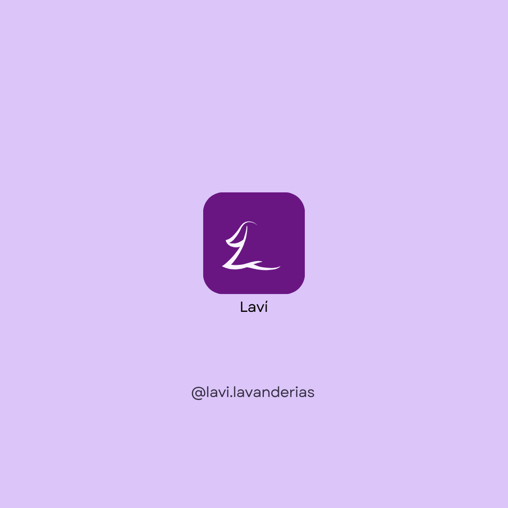

# Laví - o aplicativo de lavanderias

  

## Sobre o projeto

Laví é uma solução tecnológica em formato de aplicativo móvel projetada para otimizar a conexão entre clientes e lavanderias. O projeto foi desenvolvido como um Trabalho de Conclusão de Curso (TCC) para o curso Técnico em Desenvolvimento de Sistemas da ETEC de Taboão da Serra.

A plataforma busca resolver problemas comuns no setor de lavanderias, como a dificuldade no gerenciamento de pedidos, a falta de comunicação eficiente com os clientes e a dificuldade de encontrar serviços especializados. Para isso, o Laví oferece funcionalidades tanto para os clientes quanto para os prestadores de serviço, centralizando a busca, o agendamento e a gestão dos serviços de lavanderia.

### Proposta de valor

- **Para Clientes**: Facilitar a localização de lavanderias próximas, oferecer transparência no acompanhamento dos pedidos, e proporcionar um canal de comunicação direto com os prestadores de serviço;

- **Para empreendedores**: Oferecer uma ferramenta de gerenciamento de pedidos, otimizar a comunicação com os clientes, e aumentar a visibilidade do negócio.

## Equipe

**INSTITUIÇÃO**: Etec de Taboão da Serra - Taboão da Serra, SP - Brasil.

### Alunos

- **André de Oliveira**: desenvolvedor Back-End [@https-dre](https://github.com/https-dre)

- **Arthur Rolemberg**: desenvolvedor Front-End [@Massivo5040](https://github.com/Massivo5040)

- **Beatriz Bezerra**: líder e designer

- **Eduardo Rossi**: analista e revisor

- **Gabriel Durbano**: designer de UX UI

### Orientadoras

- Profª **Nathane de Castro** - Planejamento e desenvolvimento do TCC em desenvolvimento de sistemas
- Profª **Alícia Stefany** - Programação de Aplicativos Mobile

## Contato

André Dias - [diaso.andre@outlook.com](mailto:diaso.andre@outlook.com)

